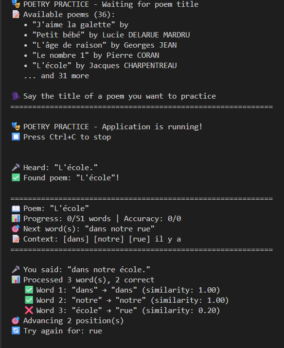
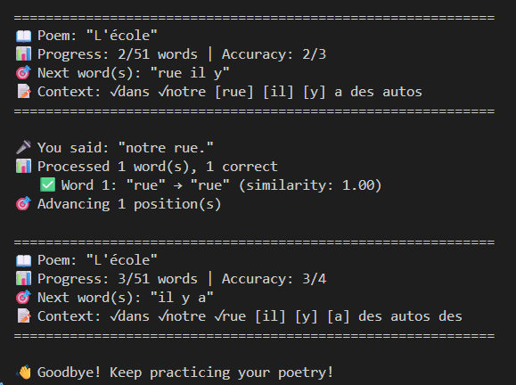

# Poetry Pronunciation Learning App

The Poetry Pronunciation Learning App is an interactive AI-powered tool that helps users practice and improve their pronunciation of poems. It uses real-time speech recognition, voice activity detection, and fuzzy word matching to provide instant feedback on spoken verses. The app guides learners through two phases — identifying the poem title and reciting it line by line — while tracking progress and accuracy.

<p align="center">
  
  
</p>

## ✨ Features
- 🎙️ Real-time speech recognition powered by Whisper (via faster-whisper)
- 📝 Two-phase learning: recognize the poem title → recite the poem
- ✅ Word-by-word feedback with similarity scoring (Levenshtein distance)
- 📊 Progress tracking: shows accuracy and recitation status
- 🔊 Noise handling & VAD (Voice Activity Detection) for reliable recognition
- 🔄 Multi-word processing: handle small chunks of spoken words naturally
- 📂 Poem database in JSON, easy to extend with more poems or different languages 
- 🧪 Unit tests for audio, similarity, and transcriber logic

## 🛠️ Technologies Used

- **ASR (Automatic Speech Recognition):**  
  [faster-whisper](https://github.com/guillaumekln/faster-whisper) + CTranslate2 backend  

- **Deep Learning Frameworks:**  
  [PyTorch](https://pytorch.org/) (`torch`, `torchaudio`)  

- **Audio Processing:**  
  [`sounddevice`](https://python-sounddevice.readthedocs.io/),  
  [`soundfile`](https://pysoundfile.readthedocs.io/),  
  [`resampy`](https://resampy.readthedocs.io/),  
  [`ffmpeg-python`](https://github.com/kkroening/ffmpeg-python),  
  [`webrtcvad-wheels`](https://pypi.org/project/webrtcvad-wheels/) for voice activity detection  

- **Text Processing:**  
  [`python-Levenshtein`](https://pypi.org/project/python-Levenshtein/) for word similarity  

- **Testing:**  
  [`pytest`](https://docs.pytest.org/), [`pytest-asyncio`](https://pypi.org/project/pytest-asyncio/)  


## to create the venv :
**Windows (PowerShell)**:
```powershell
python -m venv venv
.\venv\Scripts\Activate.ps1
```

**Linux/macOS (Bash)**:
```bash
python -m venv venv
source venv/bin/activate
```

## to install requirements :
### ! For GPU inference, ensure compatible versions of CUDA, torch, and torchaudio (mine CUDA 11.8). 
### Update requirements.txt with appropriate versions. !
```bash
pip install -r requirements.txt
```

## project structure :
```
poetry_app/
│── poetry_main.py               ## Entry point 
│── requirements.txt             ## Dependencies
│── README.md                    ## Project description
│
├── poetry/                      ## Main package
│   ├── config.py                ## Global constants & default settings
│   ├── audio.py                 ## AudioProducer, NoiseEstimator, VAD logic
│   ├── similarity.py            ## Levenshtein, matching logic
│   ├── utils.py                 ## Helpers functions
│   ├── models.py                ## PoemData, WordMatch, MultiWordResult classes
│   ├── transcriber.py           ## PoetryTranscriber class (main app logic)
│   └── state.py                 ## AppState enum and related state management
│
├── data/
│   ├── poems_1.json             ## Poems dataset
│   └── ...                      ## Any additional poem files
│
└── tests/                       ## Unit tests
    ├── test_similarity.py
    ├── test_audio.py
    └── test_transcriber.py
```

## for testing :
```bash
pytest tests/ -v
```

## example to run on CPU :
```bash
python poetry_main.py --model small --device cpu --compute int8_float32 --chunk 1 --overlap 0.5 --lang fr --poems data/poems_1.json
```

## example to run on GPU :
```bash
python poetry_main.py --model medium --device cuda --chunk 1 --overlap 0.5 --lang fr --poems data/poems_1.json
```
